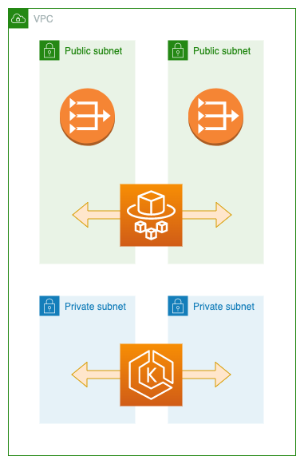

# Hello World Cluster

## Table of contents

* [Prerequisites](#prerequisites)
* [Solution](#solution)
  + [Shared Network](#shared-network)
  + [EKS](#eks)
  + [ECS](#ecs)
* [Usage](#usage)
  + [Build](#build)
  + [Deployment](#deployment)
  + [Configuration](#configuration)
* [Pipeline](#pipeline)
* [Monitoring](#monitoring)

## Prerequisites

The solution uses the following tools and versions:
- aws-cli@2.4.22
- kubectl@1.22.11
- terraform@1.2.3
- git-secrets@1.2.3
- docker@20.10.14

The deployment will require the aws-cli and the terraform-backend to be configured.

# Solution

The given solution will deploy a basic node.js application into an EKS and an ECS cluster. The ECS cluster will utilize Fargate to run the containers in a serverless environment. The same could be done in EKS, but I wanted to show the journey from classic k8s into a serverless AWS native solution.

The EKS cluster will be deployed in a private subnet which can access the internet through a NAT gateway. The cluster spans over 2 availability zones. Additional services like loadbalancers are not explicitly deployed, but will be created automatically by EKS when using a service of the type `LoadBalancer`.
The ECS service will be directly exposed with a public IP and be deployed into the public subnets.

## Shared Network

Both setups share the same network and the same ECR. Thinking about a scenario where you'd like to shift from one solution to the other, this might reduce friction in the migration itself. Even though, I'd probably advise separating the networks and move the VPC creation into a terraform module that can be referenced in both solutions to minimize redundancy.

## EKS

The kubernetes solution is creating a deployment with using a Docker Image that is pushed into AWS ECR. The deployed pods are then exposed with a Service. This will automatically provision necessary Security Groups and Load Balancers into the AWS Account.
Terraform is used to create the EKS cluster, the definition files are applied to the cluster with kubectl. This could also be done directly in terraform, but I wanted to separate the infrastructure definition from the app definition. Doing this will help to improve deployment speeds for the app in the future as app changes will be much more common than infrastructure changes, and running the infrastructure stack over and over again is not necessary, even though this will come with the cost of having to manage dependencies between these two so that the app will not be deployed into a state where underlying infrastructure changes have not yet been published.

## ECS

To also show the approach of deploying everything in one stack, I combined this for the ECS stack. In here, the ECS Cluster is deployed, as well as the Service and Task definitions. The more the application moves into a more AWS native and managed environment, the thinner will the line between app and infrastructure become, so it might be okay to combine this into one stack.
For ECS I defined a simple Task definition with the lowest possible resource consumption. A ECS Service then runs the task in a specified network. 
Using ECS will generally be much more straightforward than using k8s and help to reduce the complexity of a solution. The downside: It does not offer as many functions as k8s, especially regarding networking and separation of workloads, these requirements would have to be solved with additional AWS services and instead of adding complexity to the cluster, it will add complexity to the AWS infrastructure. 

# Usage

## Build 

The build for the application is utilizing a multi-stage build in the `Dockerfile`. This multi-stage build will reduce the size of the final image, as the build dependencies won't be included. The first stage in the file will install all dependencies and run `npm run build` to turn the TypeScript Code into JS Code that can be run with node.js. The second stage will only install production dependencies and use the code from the build stage.

## Deployment
Deploying everything can be done with `make deploy_all`, this will run `tf_deploy` at first to deploy the infrastructure. As soon as that is finished, `deploy` will be executed to build the docker image, push it to ECR and deploy the k8s resources. There is one downside to this: In the very first deployment, the ECS rollout will fail at first because it can't find the image. As soon as the image is pushed, the ECS tasks should start right away.

## Configuration
Right now, there are 2 variables for the terraform workspace: `deploy_eks` and `deploy_ecs`. Setting any of these to `false` will make terraform delete the corresponding resources. This would make it really easy to fully switch to ECS in a staging environment to test the migration. As soon as the migration is successful, and a rollback will not happen anymore, the code can be removed from terraform.

# Pipeline
I utilized GitHub Actions to briefly check my bash scripts and run a Terraform Linter. All Terraform Actions are currently executed from my local machine with terraform.io as my backend. For a production setup, it might be a good idea to move to terraform execution into the pipeline, even though this comes with a cost on speed as the pipeline will be slower than executing terraform locally.

# Monitoring
As a monitoring solution, I would suggest an external managed solution like Datadog. They can be linked to the AWS account and automatically track many AWS services. I worked with Datadog in the past, and they offer agents that can be installed on any EC2 instance where you'd like to collect additional metrics and application logs. In k8s you'd install a sidecar on every host to track running containers.
It will be a good idea to think about alerting in any production workload, and probably also on staging. But the alerting should be kept to an absolute minimum and to business critical events, to reduce the risk of missing important events due to the amount OS messages coming in. Many applications can be set up to be self-healing, so any malfunctioning host or container will be replaced. Only if this happens extraordinary often in a defined period of time, alerts should be triggered. But there are some other metrics that might be important, depending on the architecture: response times, message-queue sizes, size of dead-letter queues, amount of 5xx or 4xx errors, system load.
Finding the right level for the alerting can be hard and will be an ongoing process.